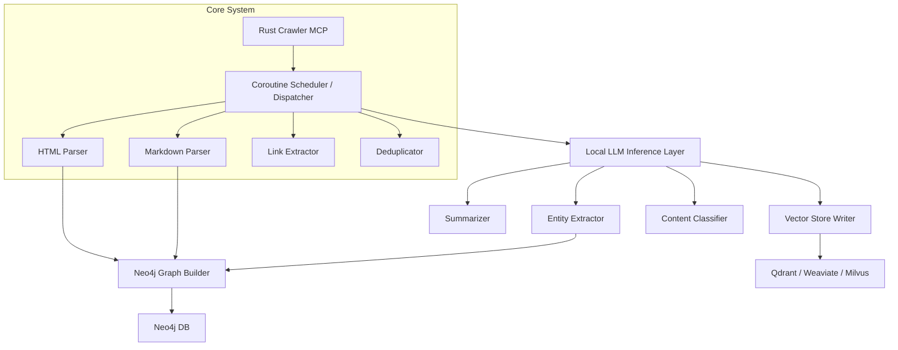
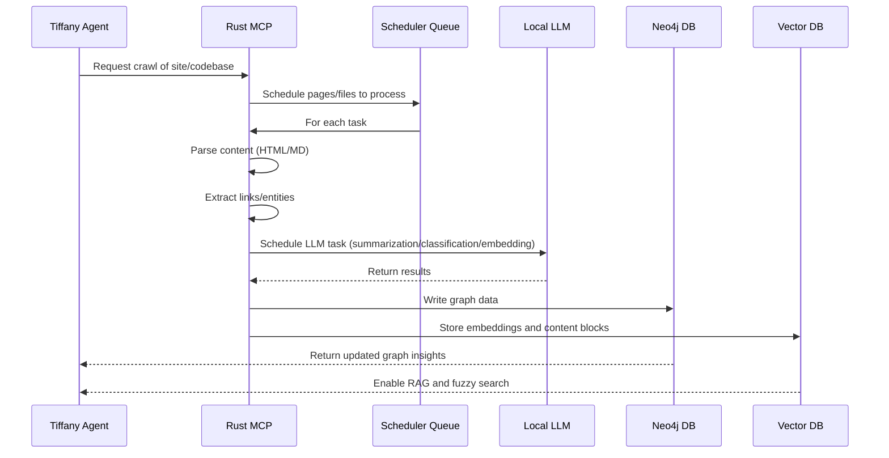
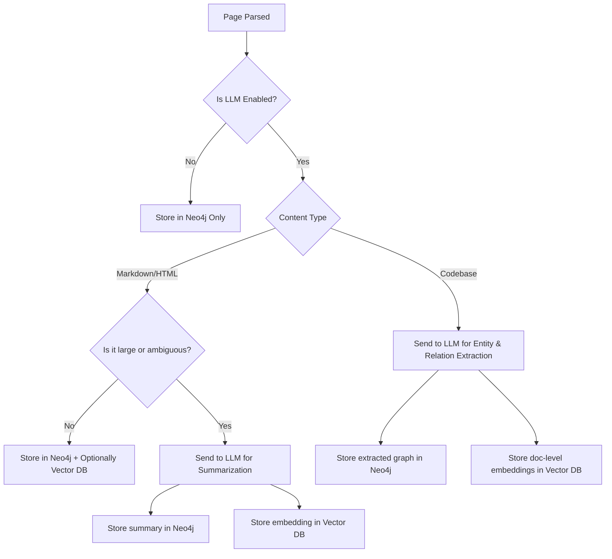

# Scarab

<p align="center">
  
</p>

> **Scarab**: a lightning-fast Rust crawler that consumes websites, codebases, and markdown — and excretes structured graphs into Neo4j, optionally augmented by local LLMs like TinyLlama.

## 🚀 Overview

Scarab is a semantic crawler engine built in Rust designed for use with autonomous agents, AI pipelines, and knowledge graph construction. Unlike traditional scrapers or document retrievers, Scarab isn't just looking for text — it's looking for *meaning*. It extracts structured relationships, content summaries, and entities using a combination of deterministic Rust parsing and optional local LLM inference.

You can run Scarab:

* As a **CLI binary** to crawl sites, convert markdown, and feed graphs
* As a **library** inside an agent or tool (e.g., Tiffany)
* As a **service** in an async pipeline

---

## ❓ Why Scarab (and why not just Python?)

Scarab exists to fill a critical gap between low-level scraping libraries and high-level LLM ingestion tools — offering performance, flexibility, and rich graph + vector output from a single runtime. Here's how it compares to alternatives:

### 🔍 Comparison to Existing Tools

| Feature / Tool               | Scarab (Rust)        | crawl4ai (Python)       | LangChain + Loaders      | Scrapy |
| ---------------------------- | -------------------- | ----------------------- | ------------------------ | ------ |
| **LLM-Aware Summarization**  | ✅ (TinyLlama, local) | ✅ (OpenAI, Claude)      | ✅ (OpenAI, mostly cloud) | ❌      |
| **Embedding + RAG Export**   | ✅ Vector DB or file  | ❌                       | ✅ with extra components  | ❌      |
| **Graph Output (Neo4j)**     | ✅ native Cypher      | ❌                       | ❌                        | ❌      |
| **Agent-Friendly Scheduler** | ✅ coroutine-rich     | ❌                       | ❌                        | ❌      |
| **Rust Speed & Memory**      | ✅                    | ❌                       | ❌                        | ❌      |
| **Disk & Redis Caching**     | ✅ content + LLM      | partial                 | ❌                        | ❌      |
| **Standalone Binary**        | ✅                    | ❌ (Python env required) | ❌                        | ❌      |
| **Modular Task Routing**     | ✅ by type/intent     | ❌                       | partial                  | ❌      |
| **Inference Backpressure**   | ✅                    | ❌                       | ❌                        | ❌      |

Scarab is designed from the ground up as a **low-latency, high-concurrency semantic ingestion system** for autonomous agents and graph-based reasoning.

It’s what you'd build if you wanted your crawler to behave more like a memory system — rather than just a fetch-and-forget scraper.

Python-based tools like `crawl4ai`, `Scrapy`, or `langchain` loaders are flexible, but they carry critical limitations:

* **Performance**: Python struggles under heavy concurrency. Crawling hundreds of pages with semantic post-processing hits CPU and memory bottlenecks.
* **Packaging Complexity**: Tools like Playwright and langchain depend on heavyweight runtimes, making deployment bloated.
* **LLM Overhead**: Python tools often block on LLM inference or use hosted APIs, adding latency, cost, and external dependencies.
* **Agent Integration**: Embedding these tools into compiled, production-grade agents (like Tiffany) introduces friction.

Scarab solves this by:

* Using **Rust** for blazing-fast parsing, memory safety, and native concurrency.
* Offering a clean binary or library with zero Python runtime.
* Supporting **TinyLlama** and other local LLMs for semantic enrichment.
* Producing **Neo4j DAGs** that agents can traverse in real-time.
* Leveraging a coroutine-based **Rich Scheduler** for efficient, concurrent task execution without blocking the main thread.

---

## 🛰️ Scarab as a Service

Scarab can also run as a long-lived microservice with a gRPC or OpenAPI interface, ideal for multi-agent or cloud deployments.

### Run the Server

```bash
scarab serve --port 5080 --config ./scarab.toml
```

### Example API (OpenAPI or gRPC Style)

```http
POST /crawl/urls
Content-Type: application/json
{
  "urls": ["https://example.com/docs", "https://example.com/faq"],
  "tags": ["project:alpha", "source:external"]
}

GET /status/{job_id}
GET /graph/{job_id}
GET /results/{job_id}/embeddings
GET /healthz
```

This service mode enables remote invocation of Scarab from Tiffany or other agents without requiring embedded execution or shell invocation. It also opens the door to containerized deployment, caching across multiple users, and shared access to Neo4j/vector outputs.

Scarab is intentionally designed to be agent-consumable but not agent-opinionated. It does **not perform content discovery or search on its own** — instead, it focuses on the efficient processing and transformation of known targets. This division of responsibility is key to modularity, observability, and composability in cognitive systems.

### ✅ How Agents Should Use Scarab

* **Search and Discovery** is the responsibility of the agent (e.g., Tiffany):

  * Tiffany may infer search goals or topics from prompts or goals.
  * Tiffany uses external search APIs (e.g., DuckDuckGo, Brave Search) to discover relevant URLs.
  * Tiffany filters and selects the most promising sources.
  * Tiffany then invokes Scarab — either as a CLI process or via direct library bindings — to process these targets.

### 🧰 Interface Options

* **Command Line**:

  ```bash
  scarab crawl --urls urls.txt --output ./graphs
  ```
* **Library Use**:

  ```rust
  let config = CrawlConfig::default();
  scarab::crawl(vec!["https://example.com"], config)?;
  ```

### 🔒 Why Not Include Search in Scarab?

While it is technically feasible to include a search hook (`--search "query"`) that uses a built-in search API client, doing so would:

* Add unnecessary external API dependencies
* Break separation of concerns between discovery and semantic crawling
* Complicate CLI/server deployments and config

Therefore, **Scarab defers discovery to the agent layer**, allowing richer and more controllable strategies while it remains focused and lightweight.

Scarab separates *mechanical* work from *semantic* work. Fast tasks (parsing, filtering, hashing, deduplication) are handled in Rust. Semantic tasks (summarization, entity recognition, classification) are optionally offloaded to a **local LLM like TinyLlama**, running through an async sidecar process.

Scarab uses a custom coroutine-based **Rich Scheduler**, inspired by PyOS8, to manage concurrent tasks. This scheduler supports fine-grained task control, priorities, and efficient non-blocking execution, and is shared with the Tiffany agent runtime when embedded.

### ⚙️ Internals

* **Disk-Based Caching Strategy**:
  Scarab supports on-disk caching of both raw page content and LLM-generated outputs. Cache entries are keyed by SHA-256 hashes of the normalized content or URL fingerprints.

  * Page content (HTML, Markdown) is stored as `.html`, `.md`, or `.json` files in `~/.scarab-cache/pages/`
  * LLM outputs like summaries and embeddings are stored as `.json` or `.bin` in `~/.scarab-cache/llm/`
  * Metadata (timestamp, source, TTL, version) is tracked in `index.ndjson`
  * Optional zstd compression and content-aware deduplication are supported

* **Alternative Cache Backends**:

  * **Redis with TTLs** can serve as a fast lookup layer for cache metadata or recent inferences.
  * **PostgreSQL** can store structured LLM outputs or logs with indexed TTL columns.
  * **MinIO** (S3-compatible) is viable for storing `.md`/`.bin` blobs at scale, especially if configured with per-object lifecycle rules. This works well for distributed or cloud deployments, but may introduce I/O latency for local runs.

* **Smart TTL Policy**:
  TTLs can be configured globally or per-type (e.g., page fetches expire after 7 days, embeddings after 30). Scarab can periodically scan the cache and remove expired entries or rely on object-store TTL enforcement.

* **Content Versioning**: Every crawled unit is fingerprinted using content or AST-level hashing to detect changes over time. This enables intelligent deduplication and historical analysis.

* **Caching Layer**: All LLM inferences and page fetches are optionally persisted to disk or Redis for reuse, minimizing redundant computation.

* **Rust core** uses crates like `reqwest`, `tokio`, `scraper`, `pulldown-cmark`, and optionally `chromiumoxide`.

* Parsed documents are converted into typed structures.

* Coroutine scheduler queues tasks for LLM inference and data extraction.

* Results are written into Neo4j using batched Cypher queries.

---

## 🚧 Dynamic Content Strategy & Limitations

Scarab supports advanced semantic extraction — but **it is not a browser**. Dynamic web pages (e.g., infinite scroll, JavaScript-rendered content, tabs, modal popups) pose a unique challenge due to the **lack of a maintained browser automation framework in Rust**.

### 🔥 Ecosystem Gaps

* `chromiumoxide` and `rust-headless-chrome` are unmaintained (4+ years)
* `fantoccini` only supports basic WebDriver (limited, slow, not CDP)
* There is **no modern, actively maintained Rust-native alternative to Playwright or Puppeteer**

### ✅ Scarab’s Tiered Fallback Strategy

To ensure reliability and performance, Scarab adopts a hybrid execution model:

1. **Static Fetching First**

  * Uses `reqwest` + `scraper` + `pulldown-cmark`
  * Ideal for well-structured docs, repos, sites

2. **Shell-out to Playwright (Node CLI or JSON-RPC)**

  * Dynamically rendered pages are fetched via subprocess or sidecar
  * Results piped into Scarab for processing
  * Controlled by config or auto-detected

3. **(Optional) WebDriver Mode via `fantoccini`**

  * For legacy or fallback scenarios

4. **(Deferred) Tiffany-Agent Managed Discovery**

  * Tiffany may selectively invoke Playwright if dynamic rendering is needed
  * Scarab remains focused on ingestion, not rendering

### 🛑 Explicit Design Constraint

Scarab does **not bundle** Node, Playwright, or headless Chrome directly. This keeps the core system lightweight and clean, while offering hooks for rich rendering pipelines.

If your ingestion use case depends heavily on JavaScript execution, we recommend running Scarab with an attached Playwright/Chrome runtime managed by your agent or CI process.

Scarab is designed to operate in a wide range of environments — from a single-core Mac Mini to a cluster of TinyLlama instances. As LLM inference speed is often the bottleneck, the system intelligently adapts:

* Tasks are tagged by **priority** and **requirement for LLM inference**.
* The **Rich Scheduler** keeps the inference queue separate from fast mechanical tasks.
* Scarab **does not block** the main processing pipeline waiting for slow inference jobs. Instead, it queues them in a low-priority or background lane.
* Users can configure maximum concurrent LLM tasks (`--llm-parallelism`) to prevent overloading lightweight machines.
* In a distributed setup, the LLM layer can be clustered behind an inference service or socket-based gateway.
* LLM-dependant results are written **incrementally** into Neo4j as they become available — downstream systems can work with partial data and refine later.

This flexibility allows Scarab to deliver performance even under constrained compute and scale up automatically with more LLM throughput.

---

## 📡 Beyond Neo4j — Vector Database and RAG Integration

While Neo4j is ideal for storing semantic graphs, Scarab also supports emitting structured embeddings for **vector database ingestion**, enabling powerful **RAG (Retrieval-Augmented Generation)** capabilities across distributed systems.

* **Embeddable Content Units** (ECUs) are generated for each processed file, document, or content block.
* These ECUs include cleaned text, source URL, context tags, and optionally LLM-summarized variants.
* Scarab can output these to a local or remote **vector store** (e.g., Qdrant, Weaviate, Milvus, or OpenSearch with vector plugins).
* Output formats include:

  * Local JSON/NDJSON files
  * HTTP POST to an embedding gateway
  * Direct gRPC client if configured
* Third-party tools — or other Tiffany instances — can independently consume these vectors for RAG, search, or reinforcement.

This separation of concerns ensures:

* Agents can query **Neo4j** for relationship and graph-walk inference
* And query **vector DBs** for fuzzy retrieval and semantic search

This makes Scarab a powerful ingestion system for multi-agent setups and federated knowledge environments.

---

## 🔧 Architecture Diagrams

### 1. Graph Diagram: Component Overview



### 2. Sequence Diagram: Crawl Lifecycle



### 3. Decision Tree: When to Use the LLM and Where to Store Output



---

## 🪄 LLM Integration with TinyLlama

Scarab supports optional handoff to a local LLM running on CPU or GPU. Our first supported model is [**TinyLlama**](https://github.com/jzhang38/TinyLlama), chosen for:

* Small footprint (runs on most developer laptops)
* Reasonable accuracy for summarization and classification
* Full local inference without API costs

LLM plugins are scheduled asynchronously via the coroutine engine. Crawling is never blocked by LLM inference unless explicitly requested (i.e., `--blocking-semantic` mode).

For users with limited compute, Scarab ensures that semantic jobs don't overwhelm local resources. Inference is deferred or prioritized as needed.

---

## 📦 Use Cases

* Build autonomous agents that traverse knowledge graphs
* Crawl docs and codebases to generate intelligent DAGs
* Feed structured data into Neo4j, llama-index, or vector DBs
* Use in pipelines where performance and flexibility matter
* Feed searchable RAG-ready vector databases for distributed agent access

---

## 🚧 Known Gaps and Future Design Considerations

Scarab’s architecture is solidly grounded, but we acknowledge several advanced or optional features that remain open for implementation:

* **Data Security & Redaction** *(Stretch Goal)*:

  * Currently no support for PII scrubbing or sensitive content filtering.
  * Future: integrate regex/LLM-based redactors (`--redact-mode`).

* **Embedding Version Control** *(Stretch Goal)*:

  * No strategy for handling re-embedding with new models.
  * Future: support `embedding_version` tagging and reindex flags.

* **Observability & Telemetry** *(Important)*:

  * No metrics/health dashboards.
  * Future: Prometheus metrics endpoint, inference latency and queue stats.

* **Plugin Interface for Extensibility** *(Stretch Goal)*:

  * No plugin system for swapping DBs, summarizers, or exporters.
  * Future: formalize traits and plugin registry (e.g., `ScarabPlugin`).

* **Distributed Crawl Coordination** *(Stretch Goal)*:

  * Not designed for multi-instance coordination out-of-the-box.
  * Future: allow external shard/queue driver, or defer to Tiffany runtime.

* **Confidence Scoring for Inference Results** *(Stretch Goal)*:

  * Currently, all LLM outputs are treated as equally reliable.
  * Future: expose token-level or task-level confidence metadata.

---

## 🛠️ Roadmap

* [x] HTML/Markdown parsing core
* [ ] Deduplication and content hashing support (Important)
* [ ] Persistent caching layer (Important)
* [ ] TinyLlama semantic plugin
* [x] Neo4j writer module
* [ ] TinyLlama semantic plugin
* [ ] Codebase crawler (e.g., GitHub, GitLab repos)
* [ ] Embedded runtime mode for Tiffany agent
* [ ] Web UI for DAG graph inspection
* [ ] Externalize Rich Scheduler crate for reuse
* [ ] Adaptive LLM throttling and task reprioritization
* [ ] Vector store output support (Qdrant, Weaviate, Milvus)
* [ ] Prometheus observability + health metrics (Important)
* [ ] Embedding version control / reindex support (Stretch Goal)
* [ ] Redaction layer and PII filtering (Stretch Goal)
* [ ] Plugin interface for exporter/LLM adapters (Stretch Goal)
* [ ] Confidence scores + LLM uncertainty logging (Stretch Goal)
* [ ] Distributed crawl coordination (Stretch Goal)

---

## 🧠 Advanced Runtime Controls for Inference Scaling

To maximize throughput and stability across diverse hardware—from low-power laptops to GPU-backed inference clusters—Scarab incorporates the following advanced runtime mechanisms:

### 🔁 Inference Batching

* Groups compatible LLM tasks (e.g., embeddings) into shared requests to reduce I/O and latency.
* Optimized for models that support batched input (e.g., TinyLlama running in vLLM or ggml).
* Reduces startup cost per token and maximizes hardware utilization.

### 🧱 Adaptive Backpressure

* Monitors LLM queue depth, memory usage, and inference time to throttle incoming semantic jobs.
* Prevents CPU/GPU overload and protects stability under high task concurrency.
* Priority-0 tasks are always processed; lower tiers may be deferred.

### ⏫ Dynamic Priority Escalation

* In-flight LLM jobs increase in priority the longer they wait.
* Ensures fairness and starvation prevention.
* Helps time-sensitive outputs get unblocked sooner as queues age.

### 🧭 Semantic Routing by Task Type

* Each task (e.g., summarization, embedding, classification) is tagged with a semantic intent.
* Routes task to optimal model instance or endpoint — especially useful in LLM clusters with model specialization.

### ⏱ Timeout and Fallback Support

* If inference exceeds a set threshold, Scarab can fallback to a cached value or deterministic heuristic.
* Ensures progress even if local inference stalls or fails.

These controls ensure Scarab remains responsive, resilient, and tunable — scaling intelligently with the compute environment.

---

## 🧩 Integration with CAG Systems (Cognitive Agent Graphs)

Scarab aligns closely with the emerging concept of a **Cognitive Agent Graph (CAG)** — a unified knowledge substrate that represents what an autonomous agent knows, observes, and plans. While Scarab does not implement the entire CAG stack, it forms a foundational component in its architecture:

### ✅ What Scarab Provides

* **Perceptual Layer**: Converts raw documents, sites, and repos into semantically structured nodes.
* **Relational Context**: Extracts edges between entities and concepts into Neo4j.
* **Embeddings & Memory Anchors**: Stores searchable content blocks in vector databases.
* **Temporal and Source Context**: Includes timestamps, source URLs, and origin metadata for traceability.

### 🚧 Delegated to the Consuming Agent (e.g., Tiffany)

Scarab intentionally **does not** handle agent-specific behaviors like:

* Action planning and intent node generation
* Reflection loops or strategy evaluation
* Multi-agent coordination logic

These CAG responsibilities belong to Tiffany or any consuming agent framework that uses Scarab’s outputs.

> By cleanly separating observation and inference from planning and action, Scarab ensures interoperability across CAG-capable systems.

---

## 🤝 Contributing

This is an open project to demonstrate how Rust + LLMs + graphs can power next-gen AI pipelines. If you’re building autonomous agents, developer tools, or search engines — join us.

> Feedback welcome. PRs welcome. Scarabs welcome.
